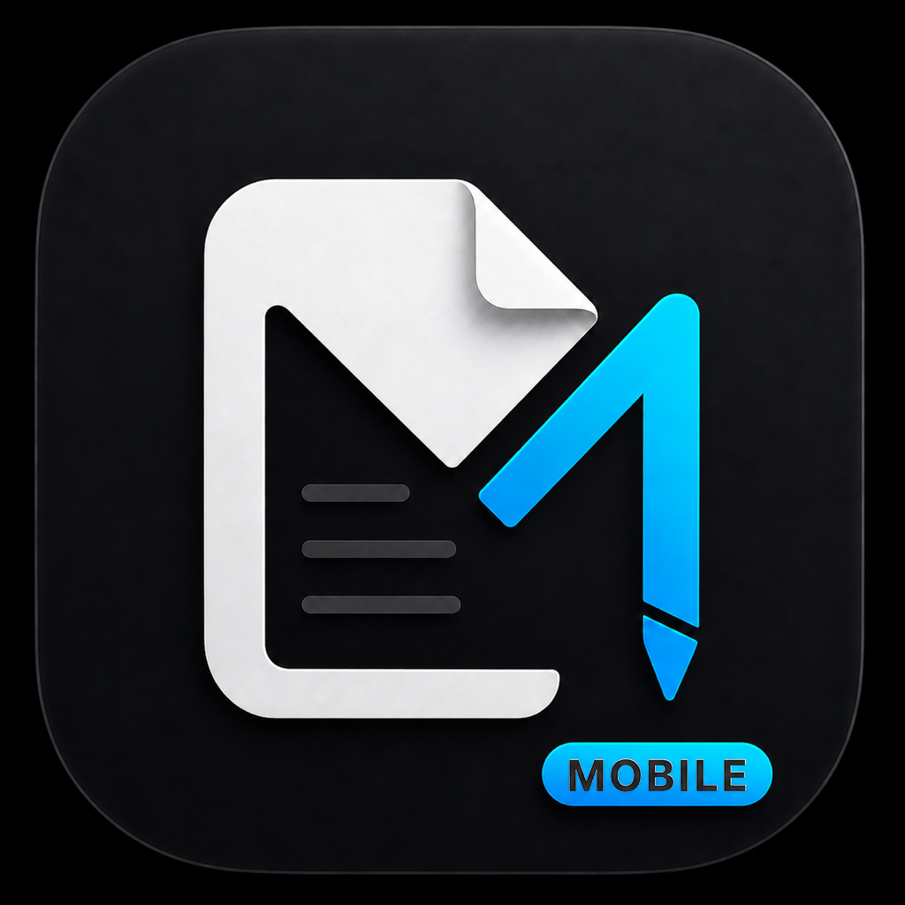
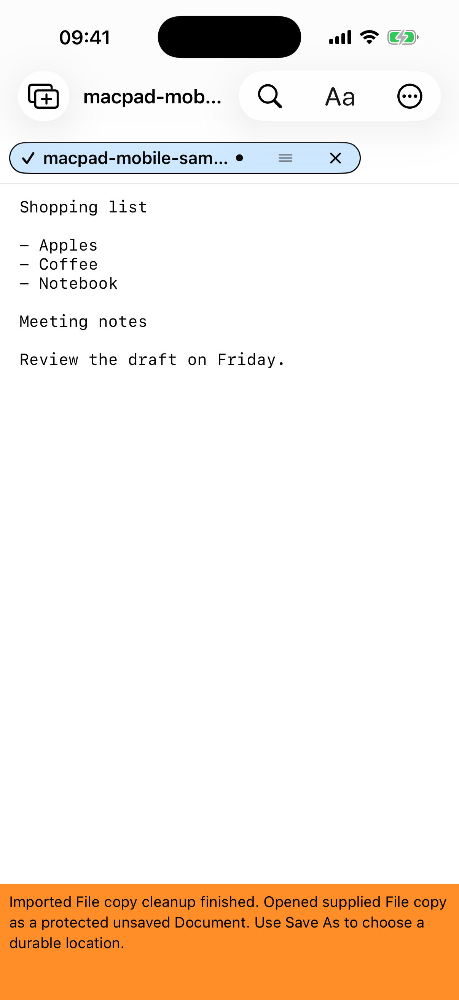
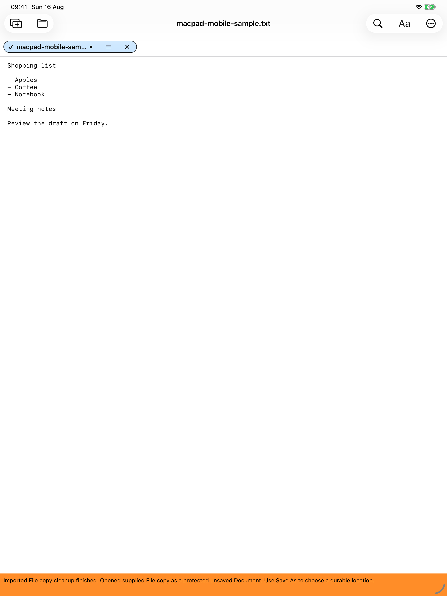

# MacPad Mobile



MacPad Mobile is a native plain-text editor for iPhone and iPad. It keeps
multiple Documents open in Tabs and works with Files chosen through Apple's
Files interface.

MacPad Mobile requires iOS 18 or iPadOS 18 or later.

> **Availability:** this repository does not currently provide a verified App
> Store, TestFlight, or downloadable release. Do not treat source availability
> as an installable customer release.

## MacPad family

- [MacPad](https://github.com/anvilfilbert/MacPad) is the native macOS editor.
- MacPad Mobile is the native iPhone and iPad editor in this repository.

The apps are separate codebases and do not automatically synchronize open
Documents, Tabs, settings, or recovery data. Files stored in a shared Apple
Files location can be opened explicitly from either app.

## Install locally with Xcode

This creates a development installation for your own iPhone or iPad. It is not
an App Store or TestFlight release.

You need:

- A Mac with Git and a version of Xcode that supports your device's OS.
- An iPhone or iPad running iOS 18 or iPadOS 18 or later.
- An Apple Account added under **Xcode > Settings > Apple Accounts**. A free
  Personal Team is sufficient for local device testing.

Install the app:

1. Clone this repository and open the Xcode project:

   ```sh
   git clone https://github.com/anvilfilbert/MacPad-Mobile.git
   cd MacPad-Mobile
   open PhonePad.xcodeproj
   ```

2. Connect and unlock the device, trust the Mac when prompted, and enable
   Developer Mode on the device if Xcode requests it.
3. In Xcode, select the `PhonePad` app target, open **Signing & Capabilities**,
   keep **Automatically manage signing** enabled, and choose your Personal
   Team. Apply the same team to `PhonePadCore` only if Xcode reports a signing
   error for that target.
4. Choose the connected device as the run destination and press **Run**.
5. If the first launch is blocked as an untrusted developer, open
   **Settings > General > VPN & Device Management** on the device, trust the
   developer app profile, and press **Run** again.

Personal Team installations are temporary and must be rebuilt when their
provisioning profile expires. TestFlight distribution requires membership in
the Apple Developer Program. Never commit signing team IDs, certificates,
provisioning profiles, or personal account details.

## Screenshots

| iPhone | iPad |
| --- | --- |
|  |  |
| Compact iPhone editor with a protected, unsaved External Open. | Expanded iPad layout with the same redacted sample Document. |

Screenshots use invented sample content and sanitized simulator status data.

## What it does

- Creates, opens, edits, saves, and prints plain-text Documents.
- Keeps multiple Documents open in one app window using Tabs.
- Provides Find, Replace, Go to Line, font selection, zoom, word wrap, and a
  status display for line, column, encoding, and line endings.
- Opens supported Files from Apple Files and other apps.
- Preserves supported encodings and dominant Windows, Unix, or classic-Mac
  line endings when an existing File is edited and saved.
- Supports touch, hardware keyboards, pointer input, Dynamic Type, VoiceOver,
  Light Mode, and Dark Mode.

## How MacPad Mobile protects work

MacPad Mobile never silently writes edits to an original File.

- **Save is explicit.** Editing, backgrounding, and closing the app do not
  overwrite a File. Choose Save to write changes.
- **Durable Files are edited directly.** When Apple Files grants durable,
  writable access, Save updates the selected File in place.
- **Detached or read-only content needs Save As.** Content without durable,
  writable access opens as an unsaved Document. The original is not modified.
- **Conflicts block Save.** If the File or its provider identity changed since
  it was opened, MacPad Mobile asks you to reload the current File, use Save As,
  or cancel. It does not auto-merge or knowingly overwrite a detected conflict.
- **Document Recovery is deliberate.** Unsaved work is protected locally when
  possible, but never reopens automatically. Open Document Recovery and choose
  what to recover or discard.

Recovery is a safety mechanism, not a substitute for saving or backing up
Files.

## Privacy

MacPad Mobile has no account, analytics, telemetry, advertising, third-party
crash-reporting SDK, or app-operated network client. It does not independently
transmit Document content or usage data.

Some explicit actions use Apple system services:

- Opening and saving use Apple Files. A selected File provider, such as iCloud
  Drive or another installed provider, may synchronize data under its own terms.
- Copy and Cut write selected text to Apple's system pasteboard; Paste reads it
  after your command. Universal Clipboard may synchronize pasteboard content
  according to device settings.
- Print hands the current Document text to Apple's system print interaction
  after your command.

Device backup, migration, Files providers, printing, and Universal Clipboard
remain controlled by Apple and the services you configure.

## Current limits

- Plain text only; no rich text, attachments, Markdown rendering, or syntax
  highlighting.
- Regular Files up to 25 MiB.
- Supported input includes UTF-8, byte-order-marked UTF-16, Windows-1252, and
  ISO-8859-1. UTF-32 and binary-like content are rejected.
- One app window on both iPhone and iPad.
- Tabs and editor settings are not restored at launch.
- Recovery stays on the device and does not synchronize across devices.
- File-provider availability and External Open behavior depend on iOS/iPadOS,
  the sending app, and the selected provider.
- English is the currently supported interface language.

## Help and feedback

- [Report a reproducible bug](/anvilfilbert/MacPad-Mobile/issues/new?template=bug-report.yml)
- [Request customer support](/anvilfilbert/MacPad-Mobile/issues/new?template=support-request.yml)
- Read [support guidance](SUPPORT.md) before including logs or screenshots.
- Read [security guidance](SECURITY.md) before reporting a vulnerability.

Never put Document content, credentials, private file paths, or security
vulnerability details in a public issue.

## Contributors

Build prerequisites, verification commands, and contribution expectations are
in [CONTRIBUTING.md](CONTRIBUTING.md). Internal targets and source modules retain
the `PhonePad` name.

## License

Source code, tests, build configuration, and documentation are licensed under
the [Apache License 2.0](LICENSE), unless a file states otherwise.

The license does not cover the MacPad Mobile name, logo, app icons,
screenshots, social-preview artwork, or other branding and artwork. Those
assets remain all rights reserved unless separately licensed. Apache-2.0 does
not grant trademark rights.
